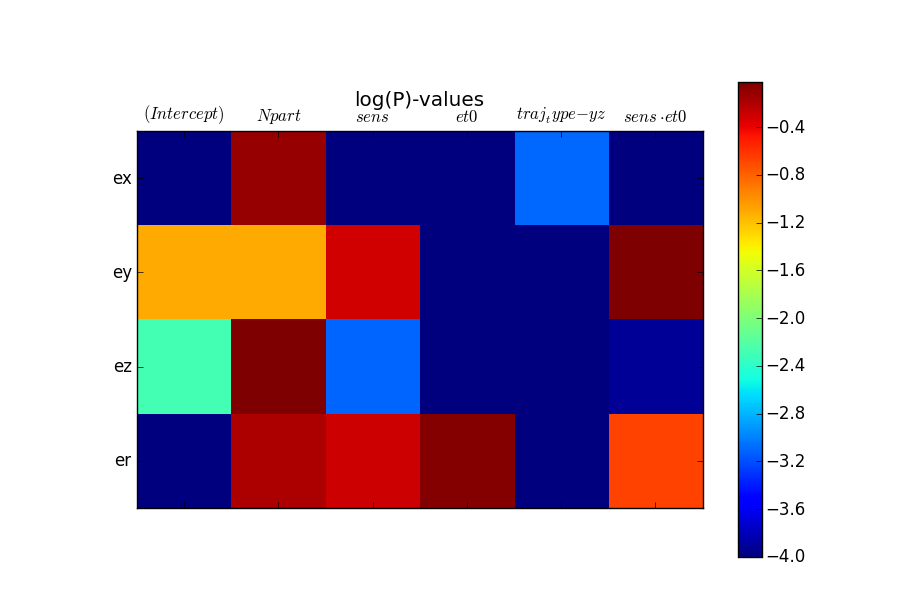
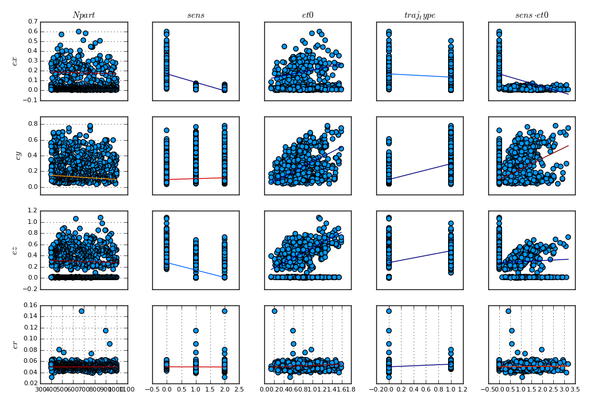

[](https://coveralls.io/github/baggepinnen/ExperimentalAnalysis.jl?branch=master)

[](https://travis-ci.org/baggepinnen/ExperimentalAnalysis.jl)

# ExperimentalAnalysis


##Functions
`scattermatrix(df::DataFrame; reglines = false)`

`scattermatrix(df::DataFrame, f::Formula; reglines = false)`

`scattermatrix(A::AbstractMatrix; reglines = false)`

`scattermatrix(m::RegressionModel)` Useful together with e.g. GLM.jl

`scattermatrix(models::Array{::RegressionModel})` Should only be used if all models have the same independent parameters, but predict different response

`modelheatmap(modelnames::AbstractArray, models::AbstractArray)`

`modelheatmap(models::AbstractArray)`

`modelheatmap(model::DataFrameRegressionModel)`

`modelheatmap(modelnames::AbstractArray, models...)`

##Example figures
###modelheatmap
The heatmap shows log(P)-values of the estimated parameters in a set of (generalized) linear models (GLM.jl package).

###scattermatrix
The scattermatrix shows a number of variables in a DataFrame, (or a number of columns in a matrix), as a function of other variables (columns). If no extra arguments are given, all variales are plotted as a function of each other. A histogram is plotted instead of a variable as a function of itself.

The scatter matrix can also show a regression model as identified by GLM.jl, where the model is drawn as line, colorcoded with log(P)-values

```julia
scattermatrix([[modelx,modely,modelz,modelr]])
```
results in

If no regression lines are wanted, a similar result can be obtained with a syntax like
```julia
scattermatrix(df, ex + ey + ez + er ~ Npart + σW1 + σV1 + σV2 + σV3)
```


##Usage examples
```julia
using ExperimentalAnalysis, DataFrames, GLM

# Run example function
perform_example_analysis()

# Create some DataFrames and linear models and visualize the result using the package functions
df1 = DataFrame(randn(10,4))
df2 = DataFrame(10randn(10,4))
modela = lm(x1 ~ x2 + x3, df1)
modelb = lm(x1 ~ x2 + x3, df2)
modelheatmap(["a", "b"], modela, modelb)
modelheatmap(["a", "b"], [modela, modelb])
scattermatrix(modela)
```

The following formula syntax may be used to create a scattermatrix, interpreted as: plot `x3` and `x4` as functions of `x1` and `x2`
```julia
scattermatrix(df1, x3 + x4 ~ x1 + x2)
```

One can also plot all variables as functions of all other variables
```julia
scattermatrix(df1)
```

Or just visualize the columns in a matrix
```julia
scattermatrix(randn(100,3).+[1,2,3])
```
